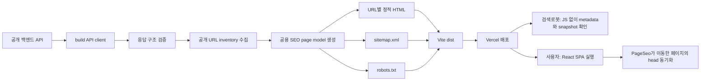

# SEO Architecture

이 문서는 HASHI Client의 SEO 전체 설계 방향과 운영 기준을 정의하는 현재 기준 문서입니다. 구현 과정의 결정 기록은 `docs/superpowers/specs/2026-08-07-seo-static-prerendering-design.md`, 실행 이력은 대응 plan 문서에 남기되, 앞으로 SEO 동작을 변경할 때는 이 문서를 먼저 갱신합니다.

## 목표

HASHI는 React Router와 Vite를 사용하는 SPA입니다. 사용자 경험은 기존 클라이언트 앱으로 유지하면서, 검색엔진에는 JavaScript 실행 전에도 페이지의 핵심 정보와 실제 공개 URL을 전달합니다.

설계 목표는 다음과 같습니다.

- 검색엔진이 홈, 식당, 메뉴, 매거진 콘텐츠를 안정적으로 발견할 수 있게 합니다.
- canonical, robots, Open Graph, JSON-LD 규칙을 build와 browser에서 동일하게 유지합니다.
- 사용자와 검색로봇에 같은 HTML을 제공하며 user-agent 기반 동적 렌더링을 사용하지 않습니다.
- 잘못되거나 불완전한 API 데이터로 SEO 파일을 배포하지 않습니다.
- 인증·사용자 전용 화면을 SEO 정책과 접근 제어 양쪽에서 분리합니다.
- URL 수가 늘어나도 service worker와 초기 앱 번들 크기가 함께 증가하지 않게 합니다.

검색 순위와 색인 시점은 보장하지 않습니다. 사이트맵과 구조화 데이터는 검색엔진의 발견과 이해를 돕는 신호입니다.

## 핵심 원칙

1. **공개 데이터만 사용합니다.** SEO build는 인증이 필요 없는 식당·메뉴·매거진 API만 조회합니다.
2. **하나의 SEO page model을 사용합니다.** build-time HTML과 runtime head가 같은 builder 결과를 소비합니다.
3. **실제 URL만 색인합니다.** route pattern이 아니라 build 시점에 API에서 발견한 구체적인 ID URL을 생성합니다.
4. **불확실하면 색인하지 않습니다.** SPA 이동 중이거나 필수 데이터가 준비되지 않은 동적 페이지는 안전한 `noindex` 상태를 사용합니다.
5. **직접 접근의 검증된 head는 보존합니다.** 프리렌더 HTML의 metadata를 API loading이나 일시적인 오류가 빈 값으로 덮지 않습니다.
6. **robots는 접근 제어가 아닙니다.** 인증 guard와 API 권한 검사는 기존 정책을 그대로 적용합니다.
7. **배포 단위로 일관성을 보장합니다.** HTML, sitemap과 공개 URL inventory는 하나의 production build에서 함께 생성하고 검증합니다.

## 색인 정책

### 색인 대상

| 페이지      | URL                                          | URL 생성 기준                       | 구조화 데이터                |
| ----------- | -------------------------------------------- | ----------------------------------- | ---------------------------- |
| 홈          | `/`                                          | 고정 URL                            | `Organization`, `WebSite`    |
| 하시 PICK   | `/restaurants/hashi-pick`                    | 고정 URL                            | `ItemList`                   |
| 인기 맛집   | `/restaurants/popular`                       | 고정 URL                            | `ItemList`                   |
| 식당 상세   | `/restaurants/{restaurantId}`                | 식당 목록 API의 양의 정수 ID        | `Restaurant`                 |
| 메뉴 상세   | `/restaurants/{restaurantId}/menus/{menuId}` | 식당별 메뉴 목록 API의 양의 정수 ID | `MenuItem`, `BreadcrumbList` |
| 매거진 목록 | `/magazines`                                 | 고정 URL                            | `CollectionPage`, `ItemList` |

사이트맵에는 `/restaurants/:restaurantId` 같은 pattern을 넣지 않습니다. 예를 들어 식당 ID가 `123`, `456`이면 두 URL을 각각 생성합니다. 메뉴도 실제 식당 ID와 메뉴 ID 조합마다 별도 URL을 생성합니다.

### 비색인 대상

| 분류                  | 대표 URL                                                                   | robots              | 링크 탐색 |
| --------------------- | -------------------------------------------------------------------------- | ------------------- | --------- |
| 검색·탐색·임시 화면   | `/search`, `/map`, `/restaurants/today`, `/coming-soon`, `/magazines/{id}` | `noindex, follow`   | 허용      |
| 인증·사용자 전용 화면 | `/mypage`, `/saved`, 예약·리뷰·OAuth 경로                                  | `noindex, nofollow` | 비권장    |
| 존재하지 않는 URL     | 임의 경로, build에 없는 식당·메뉴 ID                                       | `noindex, nofollow` | 비권장    |

`noindex`는 검색결과 제외 요청이고, `follow`는 문서 안의 링크를 검색로봇이 탐색할 수 있게 하는 지시입니다. 민감정보 보호는 이 지시가 아니라 인증과 권한 검사로 처리합니다.

## 전체 데이터 흐름



production build는 브라우저 번들을 먼저 만들고, SEO plugin이 공개 API를 조회해 같은 `dist`에 HTML과 크롤링 파일을 추가합니다. 사용자는 배포된 정적 문서를 받은 뒤 기존 React 앱을 그대로 실행합니다.

## 모듈 책임

### `apps/client/src/shared/seo`

build와 browser가 공동 사용하는 순수 SEO 규칙입니다.

| 파일                        | 책임                                                                     |
| --------------------------- | ------------------------------------------------------------------------ |
| `types.ts`                  | canonical, metadata, JSON-LD, semantic snapshot을 포함한 page model 정의 |
| `pageBuilders.ts`           | 홈·목록·식당·메뉴·매거진·noindex·404 page model 생성                     |
| `serializeSeo.ts`           | JSON-LD를 script 문맥에 안전하게 직렬화                                  |
| `routePolicy.ts`            | SPA 이동 중 route별 안전한 fallback robots 정책 결정                     |
| `SeoProvider.tsx`           | 현재 route의 metadata 소유권과 교체 lifecycle 관리                       |
| `PageSeo.tsx`               | API 데이터가 준비된 페이지의 page model 등록                             |
| `SeoRegistrationContext.ts` | 페이지 등록 context와 registration 계약 정의                             |
| `seoHead.ts`                | 현재 page model을 browser head element로 반영                            |
| `mergeSeoMagazines.ts`      | build/runtime 매거진 병합 순서와 중복 제거 통일                          |
| `parseSeoPrice.ts`          | 비어 있거나 잘못된 가격을 구조화 데이터에서 제외                         |

이 계층은 파일을 쓰거나 API를 호출하지 않습니다. 입력 데이터를 SEO page model로 바꾸는 결정만 소유합니다.

### `apps/client/seo`

Node 환경의 production build 전용 파이프라인입니다.

| 파일                        | 책임                                               |
| --------------------------- | -------------------------------------------------- |
| `seoApiClient.ts`           | native `fetch`, timeout, retry와 응답 봉투 처리    |
| `validateSeoApiResponse.ts` | endpoint별 배열, cursor와 `hasNext` runtime 검증   |
| `collectSeoInventory.ts`    | 식당·메뉴·매거진 전체 pagination과 중복 제거       |
| `generateSeoArtifacts.ts`   | inventory를 page model과 출력 파일로 조립          |
| `renderSeoDocument.ts`      | Vite HTML template에 head와 semantic snapshot 삽입 |
| `renderSitemap.ts`          | 절대 canonical URL 기반 sitemap 생성 및 한도 검증  |
| `seoPrerenderPlugin.ts`     | Vite production build 후 SEO 생성기를 실행         |

이 계층은 browser의 `ky`, TanStack Query cache, 로그인 상태를 사용하지 않습니다. generated OpenAPI type은 컴파일 시 계약으로 활용하고, 외부 응답은 별도의 runtime validator로 다시 확인합니다.

## SEO Page Model

모든 페이지 유형은 다음 정보를 하나의 model로 표현합니다.

- 절대 canonical URL
- title과 description
- `index, follow`, `noindex, follow`, `noindex, nofollow` 중 하나의 robots 정책
- Open Graph와 Twitter metadata
- 페이지 유형별 JSON-LD 객체 목록
- JavaScript 없이 읽을 수 있는 heading, summary, image, fact와 내부 링크

canonical origin은 `https://www.hashi.kr`로 고정합니다. query string과 hash를 제거하고 홈을 제외한 path에 후행 slash를 사용하지 않습니다.

API에 없거나 화면에 표시하지 않는 사실을 구조화 데이터에 추가하지 않습니다. 평점·리뷰 수·가격·영업시간처럼 선택적인 데이터가 유효하지 않으면 해당 속성 자체를 생략합니다. 특히 가격이 없는 메뉴는 `0`으로 변환하지 않고 `Offer`를 만들지 않습니다.

## 정적 HTML과 Semantic Snapshot

정적 문서는 Vite가 생성한 JavaScript와 CSS 참조를 유지하면서 다음 내용을 추가합니다.

- title, description, robots와 canonical
- Open Graph와 Twitter metadata
- 안전하게 직렬화한 JSON-LD
- 하나의 `h1`
- 핵심 설명, 대표 이미지와 페이지 사실 정보
- 검색로봇과 사용자가 이동할 수 있는 실제 내부 링크

snapshot은 숨겨진 SEO 전용 콘텐츠가 아닙니다. 현재 화면의 첫 조회 범위에 있는 정보만 사용하고, React가 mount되면 기존 SPA 화면이 같은 URL을 이어받습니다.

| 페이지              | snapshot 범위                                             |
| ------------------- | --------------------------------------------------------- |
| 홈                  | 매거진 배너와 현재 노출하는 인기 식당                     |
| 하시 PICK·인기 맛집 | 식당 첫 페이지 최대 10개                                  |
| 식당 상세           | 요약·주소·평점·가격대·영업시간과 메뉴 첫 페이지 최대 10개 |
| 메뉴 상세           | 선택 메뉴와 다른 메뉴 첫 페이지 최대 10개                 |
| 매거진              | 배너 우선 병합 후 추천 매거진을 포함한 최대 10개          |

전체 URL 발견은 snapshot 크기를 늘리는 대신 sitemap이 담당합니다. 사용자가 무한 스크롤로 다음 페이지를 불러와도 runtime `ItemList`와 head는 최초 페이지 기준으로 유지해 metadata가 스크롤에 따라 계속 바뀌지 않게 합니다.

이미지는 의미 있는 alt를 사용하고 width/height를 명시합니다. 대표 이미지는 즉시 로드하고 목록 이미지는 lazy loading과 async decoding을 사용합니다.

## Browser Runtime Lifecycle

### 정적 URL로 직접 접근

1. Vercel이 URL별 프리렌더 HTML을 반환합니다.
2. `SeoProvider`는 현재 pathname과 정적 canonical이 일치하고 robots가 `index, follow`인지 확인합니다.
3. API loading 또는 일시적인 5xx 동안 검증된 정적 head를 유지합니다.
4. 필수 API가 성공하면 페이지의 `PageSeo`가 최신 page model을 등록합니다.
5. 유효하지 않은 param이나 확인된 404는 `NotFoundPage`의 `noindex, nofollow`로 교체합니다.

### SPA 내부 이동

SPA 이동에는 새 정적 문서를 내려받지 않으므로 route가 바뀌는 즉시 안전한 fallback을 적용합니다. 식당·메뉴 같은 동적 페이지는 먼저 `noindex, follow`로 두고 필수 API 성공 후에만 `index, follow`로 전환합니다. 이전 페이지의 canonical, Open Graph와 JSON-LD는 모두 제거하고 현재 페이지 소유 element만 남깁니다.

페이지 metadata는 데이터 준비 상태와 함께 등록합니다. loading, error 또는 불완전한 필수 데이터로 빈 SEO model을 만들어 기존 정적 head를 덮어쓰지 않습니다.

## Build API와 실패 정책

SEO build는 `VITE_API_BASE_URL`의 공개 endpoint만 사용합니다.

- network 오류, timeout과 HTTP 5xx는 최초 요청을 포함해 최대 3회 시도합니다.
- retry 전 대기 시간은 500ms, 1,000ms입니다.
- HTTP 4xx와 malformed 응답은 재시도하지 않습니다.
- 응답 봉투와 endpoint별 필수 배열, `hasNext`, `nextCursor` 타입을 모두 검증합니다.
- cursor가 반복되거나 `hasNext: true`인데 다음 cursor가 없으면 build를 실패시킵니다.
- 식당 상세 수집은 최대 4개 job만 동시에 실행합니다.
- 중복 ID와 canonical 충돌을 허용하지 않습니다.
- 필수 식별자·이름 누락이나 빈 식당 inventory를 부분 성공으로 처리하지 않습니다.

한 URL의 실패를 무시한 불완전한 sitemap은 배포하지 않습니다. build가 실패하면 Vercel의 이전 성공 배포본이 유지됩니다. 로그에는 수집 건수와 실패 위치만 기록하고 응답 원문이나 credential은 출력하지 않습니다.

## 외부 URL과 직렬화 보안

- API 문자열은 HTML text, attribute, XML과 JSON-LD 문맥별로 escape합니다.
- JSON-LD의 `<` 문자를 escape해 `</script>` 주입을 방지합니다.
- 매거진 외부 URL은 build와 browser가 같은 정규화 함수를 사용합니다.
- HTTP(S) Instagram host가 아닌 외부 URL과 위험한 scheme은 링크 및 JSON-LD에서 제외합니다.
- 인증 token, 사용자 응답과 API 응답 봉투 전체를 HTML에 직렬화하지 않습니다.

## 생성 파일과 HTTP 전달

```text
apps/client/dist/
├── index.html
├── robots.txt
├── sitemap.xml
├── public-noindex-shell.html
├── private-noindex-shell.html
├── 404.html
├── magazines/index.html
└── restaurants/
    ├── hashi-pick/index.html
    ├── popular/index.html
    └── {restaurantId}/
        ├── index.html
        └── menus/{menuId}/index.html
```

Vercel은 생성된 정적 파일을 우선 제공합니다. 모든 URL을 SPA `index.html`로 보내는 포괄 rewrite는 사용하지 않습니다.

- 알려진 검색·탐색 route는 `public-noindex-shell`로 rewrite합니다.
- 인증·사용자 전용 route는 `private-noindex-shell`로 rewrite합니다.
- 생성되지 않은 식당·메뉴 ID와 알 수 없는 경로는 `404.html`과 HTTP 404를 반환합니다.
- `cleanUrls: true`, `trailingSlash: false`로 canonical 형태를 통일합니다.

동적 식당·메뉴 HTML, sitemap, robots와 noindex shell은 PWA precache에서 제외합니다. service worker는 앱 실행에 필요한 JavaScript, CSS와 기본 asset만 cache해 콘텐츠 증가가 cache 크기 증가로 직결되지 않게 합니다.

## Sitemap과 Robots

`robots.txt`는 모든 공개 path의 crawl을 허용하고 sitemap 위치를 알립니다.

```text
User-agent: *
Allow: /

Sitemap: https://www.hashi.kr/sitemap.xml
```

비색인 페이지를 `Disallow`하지 않습니다. 검색로봇이 HTML을 읽어 `noindex`를 확인할 수 있어야 하기 때문입니다.

`sitemap.xml`에는 색인 대상의 절대 canonical URL만 넣습니다. 신뢰할 수 있는 수정 시각이 없으므로 `lastmod`, `changefreq`, `priority`를 임의로 만들지 않습니다. URL 50,000개 또는 비압축 50MB 한도에 도달하면 build를 실패시키고 sitemap index 분할을 별도 작업으로 도입합니다.

## 배포와 콘텐츠 운영

SEO inventory는 production build 시점의 공개 API snapshot입니다. 새 식당이나 메뉴를 공개하는 운영 순서는 다음과 같습니다.

1. 백엔드에 공개 데이터를 등록합니다.
2. 클라이언트 production build를 실행합니다.
3. build가 전체 inventory, 정적 HTML, sitemap과 robots를 생성·검증합니다.
4. Vercel 배포가 성공한 뒤 새 URL을 외부에 노출합니다.
5. 검색엔진은 기존 sitemap URL을 다시 읽습니다.

다음 배포 전에 새 ID URL로 직접 접근하면 정적 파일이 없으므로 404가 될 수 있습니다. 콘텐츠 게시와 재배포를 자동 연결하는 기능은 현재 범위에 포함하지 않습니다.

Google Search Console과 네이버 서치어드바이저에는 `https://www.hashi.kr/sitemap.xml`을 각각 한 번 등록합니다. 페이지가 추가될 때 사이트맵 주소를 다시 만드는 것이 아니라 같은 파일의 내용이 배포마다 갱신됩니다. 대표 URL은 각 콘솔의 URL 검사 도구로 수집 상태를 확인합니다.

## 검증 기준

코드 변경은 다음 검증을 통과해야 합니다.

```bash
pnpm --filter @hashi/client lint
pnpm --filter @hashi/client typecheck
pnpm --filter @hashi/client test
pnpm --filter @hashi/client build
```

production build 후에는 다음 산출물 계약도 확인합니다.

- sitemap URL이 중복되지 않고 각 URL에 대응하는 HTML이 존재합니다.
- 색인 HTML마다 title, description, canonical과 robots가 정확히 하나씩 존재합니다.
- 모든 JSON-LD가 parse됩니다.
- private/noindex route가 sitemap에 포함되지 않습니다.
- HTML에 위험한 URL scheme, API 응답 봉투 또는 token이 없습니다.
- 동적 SEO HTML과 sitemap이 service worker precache에 포함되지 않습니다.
- 존재하지 않는 URL이 production에서 HTTP 404를 반환합니다.

## 변경 가이드

### 새 색인 페이지 추가

1. 이 문서의 색인 정책과 URL source를 먼저 정의합니다.
2. `SeoPage` builder와 단위 테스트를 추가합니다.
3. build inventory와 artifact 생성 목록에 실제 URL 수집 규칙을 추가합니다.
4. runtime 페이지는 필수 데이터 성공 후 `PageSeo`를 등록합니다.
5. sitemap, Vercel routing, PWA 제외 정책과 페이지 `*.spec.md`를 함께 확인합니다.
6. 직접 접근, SPA 이동, 404와 malformed API 회귀 테스트를 추가합니다.

### 기존 페이지 정책 변경

canonical이나 robots를 한쪽에서 직접 수정하지 않습니다. 먼저 공용 builder 또는 route policy를 변경하고 build renderer와 runtime provider가 같은 model을 소비하는지 검증합니다.

## 현재 제외 범위

- 매거진 상세 자체 콘텐츠와 상세 URL 색인
- 검색결과, 지도, 오늘의 식당, 예약·리뷰·사용자 화면 색인
- React SSR 서버 또는 검색로봇 전용 동적 렌더링
- 콘텐츠 게시 이벤트 기반 Vercel 자동 재배포
- Search Console·서치어드바이저 제출 자동화
- 검색 순위와 색인 완료 시점 보장
