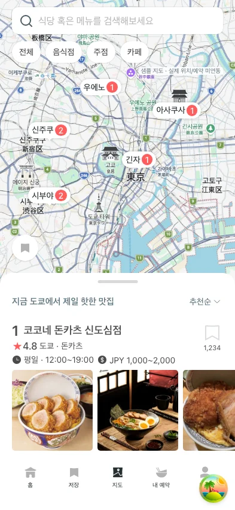
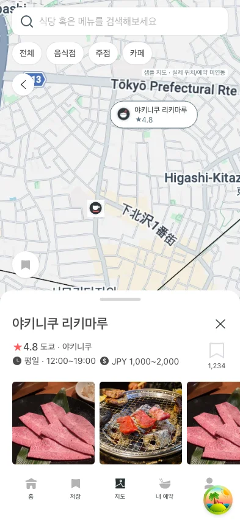

# HASHI-215 지도 퍼블리싱 QA

## 범위

- Figma `8317:32364`의 지도·목록·선택·상세·사진 보기 UI.
- 부모 PR #209 (`feat/HASHI-214-drag-panel`, `22b3fc44`)의 공통 DragPanel 사용. 부모 HDS 코드는 변경하지 않았다.
- 정적 지도, 표시용 마커 좌표, 샘플 식당/사진/수치만 제공한다. SDK, 위치 권한, 지도 이동/확대, bounding-box 검색, 실제 저장/예약은 미연동이다.
- 디자인의 OS 상태 표시줄은 앱에 그리지 않는다. 상단 safe-area 및 뷰포트에 맞춰 높이를 조절한다.

## 자동 검증

- `pnpm --filter @hashi/client test`: 145 files / 723 tests 통과.
- `pnpm --filter @hashi/client exec vitest run src/pages/map src/app/router/routes.test.tsx`: 18 tests 통과.
- `pnpm --filter @hashi/hds-ui exec vitest run src/components/dragPanel/DragPanel.test.tsx`: 19 tests 통과.
- `pnpm --filter @hashi/client lint`, `typecheck`, `build`: 통과.
- 변경 파일 Prettier 및 `git diff --check`: 통과.
- `apps/client/e2e/map.spec.ts`: Chromium 8 tests 통과. 지도/검색/카테고리 실제 클릭, 마우스·터치 손잡이, 스크롤 보존/초기화, 전체 상세의 배경 inert 및 초점 제한, 두 번째 사진 열기/닫기, sticky 제목·탭, 상세 종료 초점 복귀, 320×640·393×500·768×1024 검사.

브라우저 검증은 기존 5173 서버와 충돌하지 않도록 5176의 격리된 개발 서버와 임시 Playwright 설정으로 실행했다. API 요청은 테스트에서 401로 차단하여 로그인/백엔드에 의존하지 않는다. 기본 설정으로 재현할 때:

```sh
VITE_API_BASE_URL=http://127.0.0.1:5173 pnpm --filter @hashi/client exec playwright test e2e/map.spec.ts
```

5173에 다른 서버가 있으면 먼저 해당 서버의 소유자와 조율하거나 별도 포트 설정을 사용한다.

## 리뷰에서 보완한 부분

- 투명한 목록 wrapper가 지도/검색 클릭을 가로채던 문제 수정.
- 정렬 변경으로 목록이 재생성되어도 새 정렬 버튼으로 초점 복귀.
- 새 E2E 폴더를 TypeScript project reference에 연결해 루트 lint-staged 및 typecheck에서도 브라우저 테스트를 검사.
- 전체 상세의 배경 접근 차단 및 모달 종료 후 요약/원래 목록으로 초점 복귀.
- 지도 원본 크롭, 22px 상세 제목, 저장 수 표시를 Figma와 대조해 보완.
- 최종 별도 코드리뷰에서 남은 P1/P2 없음. API 검증 스킬은 새 API/query/mutation이 없어 관련 규칙 면제, 샘플 명세·테스트 격리·페이지 경계 확인 완료. 스킬 자체 변경 없음.

## 스크린샷과 미검증 범위

393×852 개발 화면. 오른쪽 아래 개발 도구 버튼은 기존 개발 환경 표시다.




실제 iOS/Android 키보드와 장치별 safe-area, 실제 지도 pan/zoom, API 동작은 검증하지 않았다. 축소 뷰포트 검증을 실기기 키보드 검증으로 대신 보고하지 않는다.
